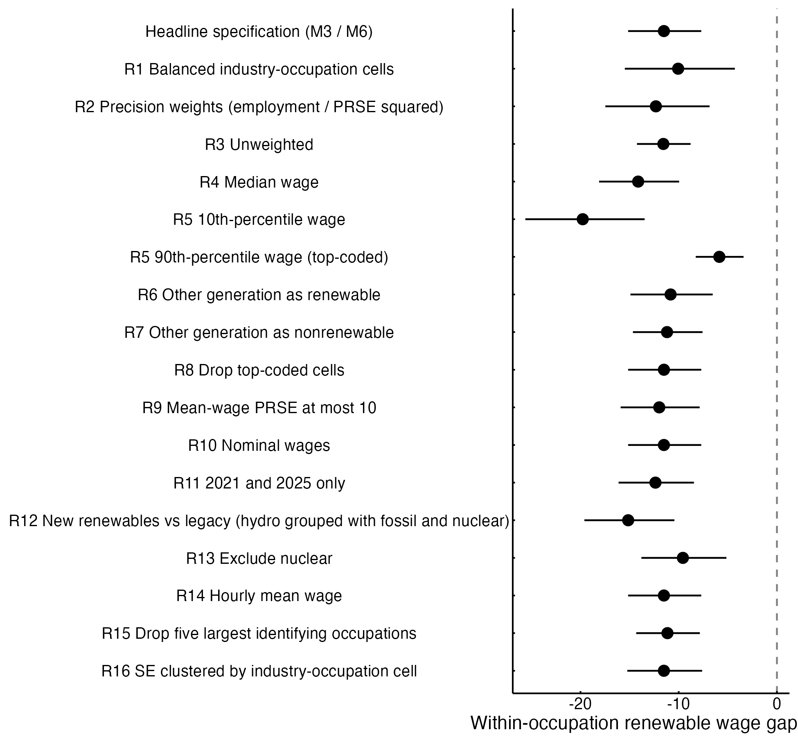

## Abstract

Renewable generation employment in the United States expanded rapidly in the early 2020s, but whether the new jobs pay like the fossil-fuel and nuclear jobs they partly replace remains unclear, because most evidence on "green" pay compares occupations rather than employers. This study asks how much less, or more, renewable generation establishments pay workers in the same detailed occupation, how the gap differs across technologies and occupational classes, and whether it changed between 2021 and 2025. Using the Bureau of Labor Statistics Occupational Employment and Wage Statistics for 2021–2025, I analyze 1,877 industry-by-occupation-by-year cells covering in-house employees of private electric power generation establishments, estimating employment-weighted regressions with occupation-by-year fixed effects, wild cluster bootstrap inference, and a Kitagawa decomposition. Within the same occupation and year, renewable establishments paid 11.5% less than fossil-fuel and nuclear establishments. The gap was concentrated in solar (−12.1%), wind (−7.3%), and biomass and geothermal (−24.4%) generation, whereas hydroelectric pay was statistically indistinguishable from fossil-fuel pay and nuclear paid 11.6% more. The gap was three times larger for blue-collar trades (−16.4%) than for professional and managerial occupations (−5.5%). Comparing estimates built from non-overlapping survey panels, the gap did not narrow while renewable employment doubled, and the worker-weighted gap widened as newly shared occupations entered. Renewable expansion has so far reproduced, not closed, a pay penalty that falls hardest on manual workers, the group at the center of just-transition debates.

**Keywords:** energy transition; just transition; renewable energy; wage inequality; occupations; job quality

**Highlights**

- Renewable plants pay 11.5% less than fossil and nuclear plants for the same job.
- Solar, wind, and biomass pay less; hydro is close to fossil; nuclear pays 11.6% more.
- Blue-collar trades face a 16% renewable pay gap; professionals and managers 5.5%.
- The gap did not narrow from 2021 to 2025 while renewable employment doubled.
- Pay penalties at the 10th percentile (−20%) exceed those at the 90th (−6%).

## 1. Introduction

Electricity generation is where the U.S. energy transition is most visible in the labor market. Between the May 2021 and May 2025 rounds of the federal establishment wage survey used in this study, employment in private renewable generation establishments roughly doubled, from about 18,000 to 36,000 workers in published occupation cells, while employment in fossil-fuel and nuclear generation was flat at about 107,000–110,000. The same years saw new federal tax credits for clean electricity under the 2022 Inflation Reduction Act. For workers, the question that matters is not only how many renewable jobs exist but what they pay. A transition that moves electricians, mechanics, and operators from coal and gas plants into solar and wind plants at lower pay would redistribute the costs of decarbonization onto the workers it was meant to protect, which is the central concern of the just-transition agenda [@stevis2015global; @mccauley2018just].

Existing evidence conflicts, largely because studies measure different things. Occupation-based analyses find that green and renewable jobs sit in occupations that pay more than average [@vona2019measures; @curtis2023green], while employer-based studies find that clean-energy firms pay no more than legacy energy firms once education is held constant [@colmer2025nice]. Neither answers the question a displaced fossil-fuel worker faces: will I be paid the same for the same job at a renewable plant?

This article answers that question directly. I use the Bureau of Labor Statistics (BLS) Occupational Employment and Wage Statistics (OEWS), which publish employment and mean wages for each detailed occupation separately in each of eight electric power generation industries defined by technology. Comparing the same detailed occupation across technologies within the same survey round separates differences in pay for a given classified job from differences in occupational mix. Five annual rounds, May 2021 through May 2025, allow me to ask whether any gap changed during the period of rapid renewable growth. Because each OEWS round pools three years of survey panels, I test change using rounds that share no panels.

Drawing on research on interindustry and between-workplace pay differences [@krueger1988efficiency; @card2013workplace] and on relational and durable-inequality accounts of how organizations allocate rewards [@tilly1998durable; @tomaskovicdevey2019relational], I argue that generation technologies are also organizational contexts with different pay-setting institutions. That argument predicts a within-occupation renewable penalty concentrated in newer technologies and in blue-collar occupations, and it predicts that the penalty persists despite growth. An ecological-modernization view [@spaargaren1992sociology] instead predicts that growth and subsidies would narrow it.

The results largely support the institutional account. Renewable establishments paid about 11.5% less than nonrenewable establishments for the same occupation, the gap was concentrated in the newer technologies and in blue-collar trades, and it did not narrow between rounds that share no survey panels. The article contributes to energy social science a technology-specific, occupation-matched benchmark of renewable job quality during the early 2020s build-out, and it shows that the renewable label hides the variation that matters for workers. Section 2 develops the argument and hypotheses, Section 3 describes the data and methods, Section 4 presents results, and Sections 5 and 6 discuss implications and limitations.

## 2. Background and theory

### 2.1 Good jobs in the energy transition?

In 2023, clean-energy employment in the United States grew more than twice as fast as the rest of the energy sector and the economy, and electric power generation is one of its main sites [@doe2024useer]. Whether this amounts to a just transition depends on more than job counts. The just-transition idea originated in the labor movement as a demand that workers not bear the costs of environmental policy [@ilo2014just; @stevis2015global], and energy-justice scholars extended it into a broader principle for sharing the burdens and benefits of decarbonization [@newell2013political; @mccauley2018just; @healy2017politicizing]. Reviews call for closer attention to what the shift away from fossil fuels means for workers and their communities [@beckfield2023social; @carley2020justice], many of which are highly exposed [@raimi2022mapping]. Interviews with unionized energy workers show that their expectations of the transition depend on whether their skills fit renewable industries and whether conditions there would strengthen or weaken their bargaining power [@sicotte2022necessary]. Because pay is a core component of job quality [@kalleberg2011good], the question is whether the jobs renewable energy creates pay like the ones they partly replace.

### 2.2 What we know about green and renewable wages

Evidence on green wages is inconsistent, partly because studies compare different quantities. A task-based measure for U.S. local labor markets finds that green employment carried a wage premium of about four percent [@vona2019measures], and green jobs in Japan pay more mainly because of their task content [@kuai2025estimating]. Using online job postings, @curtis2023green estimate that solar and wind openings cluster in occupations whose average pay is roughly a fifth above the national mean. Their measure, however, gives each posting the economy-wide average wage of its occupation: it captures the occupational mix of renewable hiring, not what renewable employers pay for a given job. Studies that observe employers are less optimistic. Linked employer-employee records indicate that clean-energy firms pay no more than legacy energy firms once education is held constant, and that few workers move from legacy to clean employers [@colmer2025nice]; transitions from carbon-intensive into green jobs absorb under one percent of those leaving carbon-intensive work [@curtis2024workers]. Norwegian evidence points to a green-firm premium below the premium paid in high-carbon industries [@godoy2025green], and industry reports show solar near the bottom of median wages across energy technologies [@lehmann2020wages]. Reviews note inconsistent definitions and comparison groups and a focus on job numbers rather than pay [@bradley2025empirical; @hanna2024job; @pearse2022labour].

These studies leave a specific gap. Occupation-level measures cannot say whether an electrician at a solar plant earns what an electrician at a gas plant earns, and firm-level studies group heterogeneous technologies into a single "clean" category. I know of no study that holds detailed occupation constant while comparing pay across generation technologies, or that asks whether such a gap narrowed as renewable generation employment expanded rapidly in the early 2020s.

### 2.3 Why the same job pays differently across sectors

Where people work matters for pay, independent of what they do. Industry wage differentials persist when worker skill, job conditions, and employer size are held constant, a pattern @krueger1988efficiency interpret as evidence that high-wage industries pay above market-clearing rates. Employer effects account for a substantial share of wage variation [@abowd1999high], and growing pay differences between workplaces account for a large share of the rise in earnings inequality in Germany [@card2013workplace] and the United States [@barth2016where; @song2019firming; @tomaskovicdevey2020rising]. Sociologists interpret these patterns relationally: organizations distribute rewards through claims-making shaped by workers' bargaining position, organizational resources, and institutional history [@tomaskovicdevey2019relational; @wilmers2021consolidated], and categorical distinctions become durable when they are built into organizational routines [@tilly1998durable]. Licensing and unionization raise pay for those inside the boundary [@weeden2002why], and unions have historically compressed wages and upheld pay norms [@western2011unions; @rosenfeld2014unions]. Much of the gender wage gap likewise reflects sorting across occupations and establishments rather than unequal pay within the same job [@petersen1995separate; @cohen2003individuals].

Applied to power generation, this literature suggests treating technology as an organizational context as well as an engineering choice. @winner1980artifacts argued, with nuclear and solar power as examples, that technologies can be bound up with particular arrangements of authority and organization. I conjecture that a similar logic applies to employment relations. Fossil-fuel and nuclear plants are large, capital-intensive, long-lived facilities, many built under the regulated-utility model with internal labor markets and formal job ladders; wind and solar generation is newer and more modular, with small permanent operations workforces. Union and project-labor coverage in 2023 was 16 to 19 percent in coal, natural gas, and nuclear generation, compared with 11 to 14 percent in solar and wind and 13 percent in water power [@doe2024useer]. If pay-setting institutions link sector to wages, I expect that, within the same detailed occupation, renewable generation establishments pay lower mean wages than nonrenewable establishments (H1). Because renewable hiring is concentrated in occupations that pay well on average [@curtis2023green], I also expect that occupational composition does not account for the renewable disadvantage, so the within-occupation gap is at least as large as the raw gap (H5).

### 2.4 Technologies, occupations, and time

The same argument implies heterogeneity. If the gap reflects the organizational form of newer technologies rather than renewable energy as such, it should be concentrated in solar, wind, biomass, and geothermal generation, negligible for hydroelectric generation, whose plants long predate the recent build-out, and absent or reversed for nuclear generation, the most institutionally consolidated technology (H2). Institutional protections also matter unequally across occupations. Collective bargaining has historically raised and compressed pay most for manual and craft workers [@western2011unions; @kalleberg2011good], whereas pay at the top of organizations is increasingly benchmarked against external peers [@diprete2010compensation], and union strategies toward renewable energy are shaped by the concern that new manual jobs will not carry legacy protections [@sicotte2025labor; @vachon2023clean]. I therefore expect the renewable gap to be larger in blue-collar trades than in professional and managerial occupations (H3).

Two perspectives make competing predictions about change. Ecological modernization treats environmental reform as a source of economic upgrading [@spaargaren1992sociology], so rapid growth and subsidies tied to prevailing-wage and apprenticeship standards should pull renewable pay toward legacy levels. Critics question whether modernization delivers the institutional change its proponents expect [@york2003key], research on renewable-energy politics emphasizes contested coalitions and uneven power rather than growth alone [@burke2018political; @knuth2019whatever; @hess2012good], and a durable-inequality reading adds that organizational pay structures adjust slowly [@tilly1998durable]. Following this view, I expect the within-occupation gap not to narrow between the earliest and latest periods observed (H4), whereas ecological modernization predicts narrowing.

## 3. Data and methods

### 3.1 Data and sample

The data are the BLS OEWS national industry-specific estimates for May 2021, 2022, 2023, 2024, and 2025. OEWS is an establishment survey that publishes, for each industry-by-occupation cell, estimated employment, mean and percentile wages, and relative standard errors. I use the eight six-digit industries of NAICS 2211, Electric Power Generation, which classify establishments by generation technology: hydroelectric (221111), fossil fuel (221112), nuclear (221113), solar (221114), wind (221115), geothermal (221116), biomass (221117), and other (221118). Industry codes are identical in all five files, and every published row refers to privately owned establishments, so the sample covers in-house employees of private generation establishments, excluding publicly owned utilities and the construction contractors who build most solar and wind capacity. These industries employed about 142,000 workers in 2021 and 159,000 in 2025, far fewer than the roughly 919,000 "electric power generation" workers counted in the broader U.S. Energy and Employment Report, which includes construction, installation, and professional services [@doe2024useer]. The comparison is thus between the permanent operations workforces of generation plants.

The unit of analysis is the industry-by-detailed-occupation-by-year cell. The OEWS files also contain major, minor, and broad occupation rows that aggregate the detailed rows; keeping only detailed occupations counts each worker once. Of 2,096 detailed cells across the five rounds, BLS suppressed the mean wage in 19 and employment in 71, leaving 2,006 published cells. The main sample excludes "other" generation (221118), whose technology mix cannot be assigned, leaving 1,877 cells (sensitivity analyses include it). Published detailed cells cover 95–98% of employment in fossil-fuel and nuclear generation but only 63–92% in renewable industries, a gap that narrowed as renewable cells became large enough to publish (Table 1). One mean wage was top-coded and was set to the published threshold.

### 3.2 Measures

The outcome is the natural logarithm of the cell's mean annual wage, converted to May 2025 dollars with the May value of the Consumer Price Index for All Urban Consumers. The focal predictor is a renewable indicator equal to 1 for hydroelectric, solar, wind, geothermal, and biomass generation and 0 for fossil-fuel and nuclear generation. A technology variable distinguishes fossil fuel (reference), nuclear, hydroelectric, solar, wind, and a pooled biomass and geothermal category, which is pooled because each industry contributes only 4–15 cells per year. Occupational class groups Standard Occupational Classification (SOC) major groups into professional and managerial occupations (SOC 11–19), blue-collar trades (construction and extraction; installation, maintenance, and repair; production; transportation), office and administrative support, and other occupations. The detailed six-digit SOC occupation is the comparison unit. No worker-level covariates are available in published cells, so comparisons are standardized only by occupation and survey round.

### 3.3 Analytic strategy

The headline model is

ln *w*~jot~ = β Renewable~j~ + γ~ot~ + ε~jot~,

where *w*~jot~ is the real mean wage of occupation *o* in industry *j* in round *t*, and γ~ot~ are occupation-by-round fixed effects. β compares renewable with nonrenewable cells of the same occupation in the same round. Cells are weighted by employment so that estimates describe the average worker, and standard errors are clustered by detailed occupation, because the same occupation appears across industries and rounds. Model M1 includes only round fixed effects (the raw gap), M2 adds occupation fixed effects, and M3 is the equation above. M4 replaces the renewable indicator with technology indicators, M5 interacts it with occupational class, and M6 interacts it with survey round. Occupations observed in only one sector, or only once within a round, do not contribute to the within-occupation comparison: 59 occupations identify the renewable contrast in 2021 and 77 in 2025, and the fixed-effects models use 1,578 cells.

Because only 59–77 occupations identify the contrast in any round, the p-values for pre-specified tests come from a restricted wild cluster bootstrap with Webb weights and 9,999 replications [@cameron2008bootstrap; @mackinnon2017wild; @webb2023reworking]. The five technology contrasts with fossil fuel are adjusted with the Holm procedure. Where a hypothesis predicts no difference (hydroelectric versus fossil fuel; change over time), I use equivalence tests [@lakens2017equivalence]. A difference is declared equivalent to zero if its 90% confidence interval lies within ±0.05 log points.

Testing change over time requires care. Each OEWS May estimate pools six semiannual survey panels collected over three years, and older panels' wages are updated using the Employment Cost Index, so BLS cautions against treating OEWS as a time series [@bls2025oews; @bls2025oewsfaq]. The May 2021 estimate uses panels from November 2018 to May 2021, May 2024 uses November 2021 to May 2024, and May 2025 uses November 2022 to May 2025. Neither later estimate shares any panel with May 2021. The pre-specified test of change is therefore the difference between the May 2025 and May 2021 gaps (with May 2024 as a secondary check). Adjacent rounds, which share four or five of six panels, are described but not tested against each other.

To separate occupational mix from pay for the same job, I decompose each year's raw gap in employment-weighted mean log wages following @kitagawa1955components. For occupations observed in both sectors (common support), the gap splits into a composition term, Σ~o~(*s*^R^~o~ − *s*^N^~o~)(ln *w*^R^~o~ + ln *w*^N^~o~)/2, and a within-occupation term, Σ~o~(*s*^R^~o~ + *s*^N^~o~)/2 · (ln *w*^R^~o~ − ln *w*^N^~o~), where *s* are each sector's employment shares renormalized on common support. A residual captures occupations found in only one sector. The within term is a worker-weighted analogue of β. Confidence intervals come from 999 bootstrap resamples of occupations. I further split the 2021–2025 change in the within term into pay change in continuing occupations, reweighting among them, and occupations entering or leaving common support.

Sixteen pre-specified robustness checks vary the sample, weights, outcome (median, 10th and 90th percentiles), technology classification, and clustering (Appendix Table A1). All estimates are descriptive. Occupation-by-round fixed effects remove differences in occupational mix but not differences in plant location, tenure, or establishment size, which the published cells do not record. The design and hypotheses were specified before the pooled models were estimated, but after the author had seen a 2025 cross-section, and they were not preregistered.

## 4. Results

### 4.1 Growth without convergence in average pay

Table 1 describes the sample. Renewable generation employment in published cells doubled from 17,990 in May 2021 to 36,400 in May 2025, driven by solar (4,350 to 16,170) and wind (5,860 to 11,420), while fossil-fuel and nuclear employment was flat. The employment-weighted mean real wage in renewable establishments was $104,800 in 2021 and $102,500 in 2025, against $120,100 and $117,400 in nonrenewable establishments. The ratio of renewable to nonrenewable mean pay was 0.873 at both ends of the period. Behind this stable ratio, mean real pay fell in nuclear, solar, and wind generation and rose in hydroelectric and biomass and geothermal generation. These raw averages mix pay for the same job with occupational mix, which the following analyses separate.

**Table 1.** Sample cells, employment, and employment-weighted mean real annual wage by generation technology, May 2021 and May 2025.

| Sector | Cells 2021 | Employment 2021 | Mean wage 2021 ($) | Cells 2025 | Employment 2025 | Mean wage 2025 ($) |
|----------------------------------------|------|--------|---------|------|--------|---------|
| Nonrenewable (fossil fuel and nuclear) | 234 | 109,830 | 120,100 | 227 | 107,220 | 117,400 |
| Fossil fuel | 134 |  73,540 | 113,500 | 129 |  70,650 | 115,000 |
| Nuclear | 100 |  36,290 | 133,300 | 98 |  36,570 | 122,100 |
| Renewable | 111 |  17,990 | 104,800 | 180 |  36,400 | 102,500 |
| Hydroelectric | 34 |   5,600 | 106,700 | 45 |   6,610 | 114,700 |
| Solar | 31 |   4,350 | 111,300 | 65 |  16,170 |  99,800 |
| Wind | 31 |   5,860 | 105,500 | 52 |  11,420 | 100,700 |
| Biomass and geothermal | 15 |   2,180 |  85,300 | 18 |   2,200 |  95,200 |
| Renewable/nonrenewable mean-wage ratio | | | 0.873 | | | 0.873 |

*Note:* OEWS national industry-specific estimates, private ownership, detailed occupations with published mean wage and employment. Wages in May 2025 dollars (CPI-U), rounded to the nearest $100.

### 4.2 The within-occupation gap

Table 2 reports the pre-specified contrasts. Without occupational standardization (M1), renewable cells paid 15.2% less than nonrenewable cells. Comparing the same occupation within the same survey round (M3) gives 11.5% (−0.122 log points; 95% CI −0.164 to −0.080; wild bootstrap *p* < 0.001). Most of the raw gap thus remains within occupations, supporting H1.

**Table 2.** Renewable and technology wage gaps within detailed occupation and survey round, OEWS 2021–2025.

| Contrast | Log points | SE | 95% CI | Percent | p |
|----------------------------------------------|----------|-----|----------------|-------|------|
| Renewable, raw (M1) | -0.165 | 0.071 | [-0.306, -0.024] | -15.2 | 0.022 |
| Renewable, occupation × year FE (M3) | -0.122 | 0.021 | [-0.164, -0.080] | -11.5 | <0.001 |
| Nuclear vs fossil fuel (M4) | 0.110 | 0.013 | [0.085, 0.134] | 11.6 | <0.001 |
| Hydroelectric vs fossil fuel (M4) | -0.020 | 0.026 | [-0.072, 0.032] | -2.0 | 0.739 |
| Solar vs fossil fuel (M4) | -0.129 | 0.030 | [-0.189, -0.069] | -12.1 | <0.001 |
| Wind vs fossil fuel (M4) | -0.076 | 0.024 | [-0.123, -0.030] | -7.3 | 0.008 |
| Biomass/geothermal vs fossil fuel (M4) | -0.280 | 0.032 | [-0.343, -0.216] | -24.4 | 0.008 |
| Solar minus hydroelectric (M4) | -0.109 | 0.042 | [-0.192, -0.026] | -10.3 | 0.016 |
| Wind minus hydroelectric (M4) | -0.056 | 0.026 | [-0.108, -0.004] | -5.5 | 0.041 |
| Professional and managerial (M5) | -0.057 | 0.022 | [-0.099, -0.014] | -5.5 | 0.014 |
| Blue-collar trades (M5) | -0.179 | 0.026 | [-0.229, -0.128] | -16.4 | <0.001 |
| Office and administrative support (M5) | -0.134 | 0.035 | [-0.204, -0.064] | -12.6 | 0.006 |
| Other occupations (M5) | -0.117 | 0.059 | [-0.233, -0.001] | -11.0 | 0.301 |
| Blue-collar minus professional/managerial (M5) | -0.122 | 0.033 | [-0.188, -0.056] | -11.5 | 0.008 |
| Renewable gap, May 2021 (M6) | -0.121 | 0.026 | [-0.172, -0.069] | -11.4 | <0.001 |
| Renewable gap, May 2025 (M6) | -0.139 | 0.023 | [-0.184, -0.094] | -13.0 | <0.001 |
| Change, May 2025 minus May 2021 (M6) | -0.019 | 0.018 | [-0.055, 0.018] | -1.8 | 0.330 |
| Change, May 2024 minus May 2021 (M6) | 0.008 | 0.022 | [-0.036, 0.051] | 0.8 | 0.737 |

*Note:* Weighted least squares on log real mean annual wage; weights = cell employment; M1 includes round fixed effects and M3–M6 occupation-by-round fixed effects. Standard errors clustered by detailed occupation (122 clusters in M3–M6). Percent = 100 × (exp(b) − 1). *p*: Holm-adjusted wild cluster bootstrap for technology-versus-fossil contrasts; wild cluster bootstrap (Webb weights, 9,999 draws) for other pre-specified contrasts; cluster-robust *t* for M1 and the round-specific gaps. N = 1,877 cells (M1) and 1,578 (M3–M6) after singleton removal. Full regression models, including M2, are in Appendix Table A2.

The decomposition in Table 3 gives the same answer with explicit worker weights. Among occupations found in both sectors, the composition term was small and, in four of five years, slightly positive (0.014 to 0.027 log points; bootstrap intervals include zero). Renewable employment is thus not concentrated in lower-paid shared occupations, consistent with job-posting evidence [@curtis2023green]. The within-occupation term ranged from −0.109 to −0.163 log points. The remainder of the raw gap comes from occupations observed in only one sector, which account for 6–23% of renewable employment. H5 is supported in its core claim that composition does not explain the renewable disadvantage. The stronger prediction, that the within gap would be at least as large as the raw gap, holds only in 2023 and nearly in 2022, because occupations unique to one sector add a further renewable disadvantage in the other years.

**Table 3.** Kitagawa decomposition of the renewable minus nonrenewable gap in employment-weighted mean log real wages, by survey round.

| Year | Raw | Composition | Within occupation [95% CI] | Occupations off support | Shared occupations | Renewable employment off support |
|--------|------|-----------|--------------------------|-----------------------|------------------|--------------------------------|
| May 2021 | -0.166 | 0.026 | -0.109 [-0.152, -0.057] | -0.082 | 59 | 23% |
| May 2022 | -0.157 | 0.027 | -0.150 [-0.236, -0.075] | -0.034 | 60 | 6% |
| May 2023 | -0.145 | 0.014 | -0.146 [-0.197, -0.084] | -0.013 | 68 | 11% |
| May 2024 | -0.172 | -0.002 | -0.137 [-0.193, -0.068] | -0.033 | 71 | 14% |
| May 2025 | -0.180 | 0.024 | -0.163 [-0.217, -0.099] | -0.041 | 77 | 13% |

**Change in the within-occupation gap, May 2021 to May 2025**

| Component | Log points |
|---------------------------------------------|----------|
| Change in within-occupation gap, 2021 to 2025 | -0.053 |
|   Pay change in continuing occupations | -0.020 |
|   Reweighting of continuing occupations | 0.018 |
|   Entering minus exiting occupations | -0.051 |

Bootstrap 95% CI for the change: [-0.112, -0.001]; continuing occupations = 54, entering = 23, exiting = 5.

*Note:* Raw = composition + within occupation + occupations off support. Composition and within terms use midpoint employment shares renormalized on occupations observed in both sectors in that round. 95% confidence intervals from 999 bootstrap resamples of occupations.

### 4.3 Technologies: the renewable label hides the variation

Fig. 1a shows that the pay gap differs sharply by technology. Relative to fossil-fuel generation in the same occupation and round, solar establishments paid 12.1% less (Holm-adjusted *p* < 0.001), wind 7.3% less (*p* = 0.008), and biomass and geothermal 24.4% less (*p* = 0.008). Hydroelectric pay was 2.0% lower but not distinguishable from fossil-fuel pay (*p* = 0.739; 95% CI −6.9% to +3.2%). Its 90% interval (−0.063 to 0.023 log points) extends just beyond the equivalence margin, so equivalence is not established either. Nuclear establishments paid 11.6% more than fossil-fuel establishments (*p* < 0.001). Solar and wind both paid significantly less than hydroelectric generation (by 10.3% and 5.5%), so the dividing line runs between mature and new technologies, not between renewable and nonrenewable energy. Grouping hydroelectric with the legacy technologies enlarges the gap between new renewables and legacy plants to 15.1% (−0.164; Appendix Table A1). H2 is supported for solar, wind, and nuclear. For hydroelectric generation the data show no significant difference but cannot rule out a gap of about six percent.

{width=95%}

Fig. 1b traces the technology gaps across rounds. Two patterns stand out, though adjacent rounds share most of their survey panels. First, the nuclear premium over fossil-fuel generation narrowed steadily, from 15.9% in May 2021 to 5.0% in May 2025, as nuclear real pay fell (Table 1). Second, solar and wind did not converge on fossil-fuel pay. The solar gap was −12.4% in 2021 and −16.5% in 2025, and wind moved from parity in 2021 (+0.7%) to −9.0% in 2025.

### 4.4 Occupations: penalties concentrated in blue-collar trades

The renewable penalty differed across occupational classes (joint Wald test of equal gaps, *p* = 0.004; Fig. 2a). It was 16.4% for blue-collar trades (95% CI −20.5% to −12.0%), 12.6% for office and administrative support, and 5.5% for professional and managerial occupations (−9.5% to −1.4%). The pre-specified contrast between blue-collar and professional/managerial gaps was −0.122 log points (wild bootstrap *p* = 0.008), so blue-collar workers face a gap three times as large, which supports H3. Separating managers from other professional and technical occupations gives gaps of 3.5% and 6.6% for these groups.

{width=90%}

The major-group detail in Fig. 2b makes the gradient concrete. In architecture and engineering occupations, renewable and nonrenewable plants paid essentially the same (−0.8%), and the management gap was small (−3.5%). Gaps were large in construction and extraction (−28.3%), transportation and material moving (−35.5%), and production (−17.6%), where power-plant operators and related jobs are classified, and moderate in installation, maintenance, and repair (−8.1%). Engineers at renewable plants are paid close to their fossil-fuel counterparts; operators, technicians, and laborers are not.

Distributional checks point the same way: the gap was 19.8% at the 10th percentile of within-cell wages, 14.1% at the median, and 5.9% at the 90th percentile (Appendix Table A1). These are reported within-cell percentiles, not worker-level quantiles, and top-coding compresses the upper tail, but the pattern is consistent with stronger wage floors in nonrenewable plants.

### 4.5 Change over time: persistence, not convergence

Fig. 3 plots the gaps by round. The regression-based within-occupation gap (M6) was −0.121 log points in May 2021 and −0.139 in May 2025. The pre-specified change between these rounds, which share no survey panels, was −0.019 log points (95% CI −0.055 to 0.018; wild bootstrap *p* = 0.330). Its 90% interval (−0.049 to 0.012) lies within the ±0.05 equivalence margin, so by the pre-specified rule the gap was stable: any narrowing larger than about five percent can be ruled out. The secondary contrast between May 2021 and May 2024 gives the same conclusion (+0.008; 90% CI −0.029 to 0.044). Year-specific gaps were not identical across all five rounds (joint Wald *p* = 0.040), mainly because the gap was smaller in May 2022 (−0.105) and larger in May 2025 (−0.139); the May 2022 round shares four of its six panels with May 2021. H4 is supported: rapid growth and new subsidies did not close the within-occupation pay gap.

{width=90%}

The worker-weighted decomposition suggests that, if anything, the gap widened. The within-occupation term moved from −0.109 in 2021 to −0.163 in 2025, a change of −0.053 log points (bootstrap 95% CI −0.112 to −0.001). Splitting this change shows where it comes from. Pay changes within the 54 occupations observed in both sectors in both rounds contributed only −0.020, and shifting employment among them contributed +0.018. The rest (−0.051) reflects the 23 occupations that entered common support by 2025, net of 5 that left, as the growing solar and wind workforces became large enough for BLS to publish more occupation cells; on average these entering occupations carry larger renewable penalties. The widening thus reflects renewable employment broadening into occupations with large penalties more than deteriorating pay within continuing occupations. Measured against fossil fuel alone (excluding nuclear, whose premium shrank), the regression change was −0.040 (95% CI −0.080 to 0.000), again pointing toward persistence or modest widening rather than convergence.

### 4.6 Robustness

The within-occupation gap is negative and statistically significant in all sixteen alternative specifications (Appendix Table A1), from −0.060 (90th percentile) to −0.220 (10th percentile) log points, including −0.106 in cells present in all five rounds, −0.123 without weights, and −0.118 after dropping the five largest identifying occupations. No specification shows a significant narrowing between 2021 and 2025; the estimated change ranges from −0.049 to +0.015 log points, and every 95% interval includes zero.

## 5. Discussion

The question motivating this study was whether the jobs created by the expansion of renewable electricity pay like the jobs they partly replace. For the in-house workforces of U.S. generation plants in 2021–2025, the answer is no. Workers in the same detailed occupation were paid about 11.5% less in renewable establishments than in fossil-fuel and nuclear establishments, the gap did not narrow while renewable employment doubled, and it was largest for the operators, technicians, mechanics, and laborers whose skills most closely match those of workers leaving coal and gas plants. These findings fit employer-based evidence that clean-energy firms pay no more than legacy firms once education is held constant [@colmer2025nice] and qualify occupation-based findings that renewable jobs are well paid [@curtis2023green]: renewable hiring does sit in well-paid occupations, but renewable establishments pay those occupations less, so measures that assign every worker the occupation's average wage overstate what renewable employers pay.

The technology results speak to the theoretical argument. If the penalty reflected something intrinsic to "green" work, such as lower productivity, greater task simplicity, or the novelty of renewable skills, hydroelectric generation should share it. It does not. Hydroelectric pay is statistically indistinguishable from fossil-fuel pay, while solar and wind, the newest and fastest-growing technologies, pay significantly less than both fossil fuel and hydro. The dividing line runs between legacy and new technologies, which is what an organizational account of pay-setting predicts [@winner1980artifacts; @tomaskovicdevey2019relational]. Published union and project-labor coverage rates are broadly consistent with this ordering: about 19% in nuclear generation, 16–17% in coal and natural gas, 13% in water power, 12% in wind, and 11–14% in solar generation [@doe2024useer]. The premium in nuclear plants, the most institutionally consolidated technology, also fits. The correspondence is loose: hydroelectric coverage resembles wind coverage, yet only wind shows a gap, and the coverage figures refer to a broader workforce. Union coverage alone cannot be the mechanism; plant vintage, utility ownership, internal job ladders, and regional labor markets are plausible complements. The institutional interpretation is consistent with the patterns but untested.

The occupational gradient sharpens the just-transition stakes. Engineers and managers carry their market value across technologies: renewable and fossil-fuel plants pay them about the same. The penalty falls on manual and craft workers, and it is larger at the bottom of within-cell wage distributions than at the top. This is where collective bargaining and internal labor markets have historically raised and compressed pay [@western2011unions; @kalleberg2011good], and where union members fear that renewable jobs will not carry legacy protections [@sicotte2022necessary; @sicotte2025labor]. A fossil-fuel power-plant operator or construction-and-extraction worker who moves to a solar or wind plant in the same occupation should expect to earn substantially less, on average. Combined with evidence that few workers make that move at all [@curtis2024workers], this suggests the transition's labor-market costs are borne disproportionately by manual workers, the group whose protection motivated the just-transition idea [@ilo2014just; @newell2013political].

The persistence result bears on the ecological-modernization expectation that growth and policy support would pull renewable pay up [@spaargaren1992sociology]. Between survey rounds that share no data, the within-occupation gap changed by less than two percentage points, and a narrowing of more than about five percent can be ruled out. The worker-weighted gap widened as the renewable workforce broadened into occupations with large penalties. Two cautions apply. First, the OEWS estimates for 2025 still include panels collected before most 2022 policy changes could affect operations staffing, and wage aging smooths change, so the window may be too short to see later effects. Second, to the extent that the labor standards attached to the new clean-electricity tax credits apply mainly to construction, alteration, and repair work, they would not directly reach the permanent operations workforce studied here. Even so, through May 2025 the expansion reproduced the legacy pay hierarchy instead of eroding it [@tilly1998durable; @york2003key]. The declining nuclear premium is a separate pattern that this study cannot explain and that deserves direct study.

### 5.1 Limitations

The estimates are descriptive: workers are compared within the same classification, not the same tenure, region, or employer size. Wind and solar plants are likely to be sited in more rural areas with lower prevailing wages, and their workforces are newer, so part of the gap may reflect geography and seniority rather than pay-setting for identical work. State-by-industry tables or linked employer-employee data could separate these explanations. The sample is limited to private, in-house employees of generation establishments. It excludes publicly owned utilities, including federal and municipal hydroelectric plants, and the much larger construction and installation workforce, whose pay is shaped by project labor agreements and prevailing-wage rules. Results may differ for these groups. Suppression removes more renewable than nonrenewable employment, although balanced-cell and continuing-occupation analyses suggest it does not drive the headline gap. Because OEWS rounds pool three years of panels, trend inferences rest on two non-overlapping comparisons with limited power. Finally, the hypotheses were developed after the author had seen a 2025 cross-section and were not preregistered.

## 6. Conclusion

Renewable electricity generation in the United States grew rapidly in the early 2020s, but the jobs it created inside generation plants paid about 11.5% less than fossil-fuel and nuclear jobs in the same occupation, and this gap did not shrink as renewable employment doubled. The penalty is not a property of renewable energy as such. It is concentrated in the newer solar, wind, and biomass and geothermal technologies, absent in long-established hydroelectric plants, and borne mainly by blue-collar workers. For a just transition, job counts are not enough. Policies that attach wage and bargaining standards to the permanent operations workforce of new generation, not only to construction, and that help displaced fossil-fuel workers carry their pay and protections into renewable plants, would address the gap this study documents. Future work should test the institutional mechanisms directly, using plant ownership, union coverage, and worker tenure, and should track whether the gap closes as renewable operations workforces mature.

## Declarations

**Data availability.** All data are public: BLS Occupational Employment and Wage Statistics national industry-specific estimates (May 2021–2025) and CPI-U series CUUR0000SA0. Analysis code (R) that reproduces every table and figure from the raw BLS files is provided in the replication materials.

**Declaration of generative AI use.** During the preparation of this work the author used an AI assistant (Claude, Anthropic) to search and verify literature, write and review analysis code, and draft and edit text. The author reviewed and edited all content and takes full responsibility for the publication.

**Competing interests.** The author declares no competing interests.

**Funding.** This research received no specific funding.

**CRediT authorship contribution statement.** [Author]: Conceptualization, Methodology, Formal analysis, Data curation, Writing – original draft, Writing – review and editing.

## References

::: {#refs}
:::

\newpage

## Appendix

**Table A1.** Robustness of the within-occupation renewable wage gap (model M3) and of the May 2025 minus May 2021 change (model M6).

| Specification | Cells | Gap (log points) [95% CI] | Change 2025–2021 [95% CI] |
|--------------------------------------------------------------------|-----|-------------------------|-------------------------|
| Headline specification (M3 / M6) | 1578 | -0.122 [-0.164, -0.080] | -0.019 [-0.055, 0.018] |
| R1 Balanced industry-occupation cells |  975 | -0.106 [-0.168, -0.044] | 0.015 [-0.011, 0.041] |
| R2 Precision weights (employment / PRSE squared) | 1578 | -0.132 [-0.192, -0.071] | -0.012 [-0.105, 0.082] |
| R3 Unweighted | 1578 | -0.123 [-0.154, -0.092] | -0.009 [-0.062, 0.044] |
| R4 Median wage | 1578 | -0.152 [-0.200, -0.105] | 0.009 [-0.041, 0.059] |
| R5 10th-percentile wage | 1578 | -0.220 [-0.296, -0.145] | -0.004 [-0.077, 0.069] |
| R5 90th-percentile wage (top-coded) | 1578 | -0.060 [-0.086, -0.035] | -0.049 [-0.104, 0.006] |
| R6 Other generation as renewable | 1709 | -0.115 [-0.162, -0.068] | -0.038 [-0.083, 0.008] |
| R7 Other generation as nonrenewable | 1709 | -0.119 [-0.159, -0.079] | -0.017 [-0.053, 0.020] |
| R8 Drop top-coded cells | 1577 | -0.122 [-0.164, -0.080] | -0.018 [-0.055, 0.018] |
| R9 Mean-wage PRSE at most 10 | 1456 | -0.128 [-0.173, -0.082] | -0.014 [-0.048, 0.020] |
| R10 Nominal wages | 1578 | -0.122 [-0.164, -0.080] | -0.019 [-0.055, 0.018] |
| R11 2021 and 2025 only |  630 | -0.132 [-0.176, -0.088] | -0.019 [-0.055, 0.018] |
| R12 New renewables vs legacy (hydro grouped with fossil and nuclear) | 1578 | -0.164 [-0.218, -0.110] | -0.016 [-0.060, 0.029] |
| R13 Exclude nuclear | 1031 | -0.101 [-0.148, -0.053] | -0.040 [-0.080, 0.000] |
| R14 Hourly mean wage | 1578 | -0.122 [-0.164, -0.080] | -0.019 [-0.055, 0.018] |
| R15 Drop five largest identifying occupations | 1450 | -0.118 [-0.155, -0.082] | -0.039 [-0.092, 0.014] |
| R16 SE clustered by industry-occupation cell | 1578 | -0.122 [-0.165, -0.079] | -0.019 [-0.059, 0.022] |

*Note:* Log points; 95% confidence intervals clustered by detailed occupation (R16: by industry-by-occupation cell). Percentile outcomes are reported within-cell percentiles; the 90th percentile is top-coded in some legacy cells. R10 and R14 coincide with the headline estimate because occupation-by-round fixed effects absorb the CPI deflator and the 2,080-hour annualization. R11 reproduces the headline change because round-specific fixed effects make each round's gap estimable from that round alone.

**Table A2.** Main regression models (coefficients in log points; standard errors clustered by detailed occupation in parentheses).

| | M1 Raw | M2 Occupation FE | M3 Occupation x year FE | M4 Technology | M5 Occupational class | M6 Year |
|---|---|---|---|---|---|---|
| Renewable generation | -0.165* | -0.124*** | -0.122*** |  |  |  |
|  | (0.071) | (0.021) | (0.021) |  |  |  |
| Nuclear |  |  |  | 0.110*** |  |  |
|  |  |  |  | (0.013) |  |  |
| Hydroelectric |  |  |  | -0.020 |  |  |
|  |  |  |  | (0.026) |  |  |
| Solar |  |  |  | -0.129*** |  |  |
|  |  |  |  | (0.030) |  |  |
| Wind |  |  |  | -0.076** |  |  |
|  |  |  |  | (0.024) |  |  |
| Biomass and geothermal |  |  |  | -0.280*** |  |  |
|  |  |  |  | (0.032) |  |  |
| Renewable × professional and managerial |  |  |  |  | -0.057** |  |
|  |  |  |  |  | (0.022) |  |
| Renewable × blue-collar trades |  |  |  |  | -0.179*** |  |
|  |  |  |  |  | (0.026) |  |
| Renewable × office and administrative support |  |  |  |  | -0.134*** |  |
|  |  |  |  |  | (0.035) |  |
| Renewable × other occupations |  |  |  |  | -0.117* |  |
|  |  |  |  |  | (0.059) |  |
| Renewable × 2021 |  |  |  |  |  | -0.121*** |
|  |  |  |  |  |  | (0.026) |
| Renewable × 2022 |  |  |  |  |  | -0.105*** |
|  |  |  |  |  |  | (0.015) |
| Renewable × 2023 |  |  |  |  |  | -0.128*** |
|  |  |  |  |  |  | (0.025) |
| Renewable × 2024 |  |  |  |  |  | -0.113*** |
|  |  |  |  |  |  | (0.028) |
| Renewable × 2025 |  |  |  |  |  | -0.139*** |
|  |  |  |  |  |  | (0.023) |
| Cells | 1877 | 1856 | 1578 | 1578 | 1578 | 1578 |
| R² | 0.057 | 0.907 | 0.915 | 0.943 | 0.920 | 0.915 |

*Note:* Weighted least squares; weights = cell employment; outcome = log real mean annual wage (May 2025 dollars). M1 includes round fixed effects; M2 occupation and round fixed effects; M3–M6 occupation-by-round fixed effects. Reference technology in M4: fossil fuel. * *p* < 0.05, ** *p* < 0.01, *** *p* < 0.001 (cluster-robust).

{width=85%}
